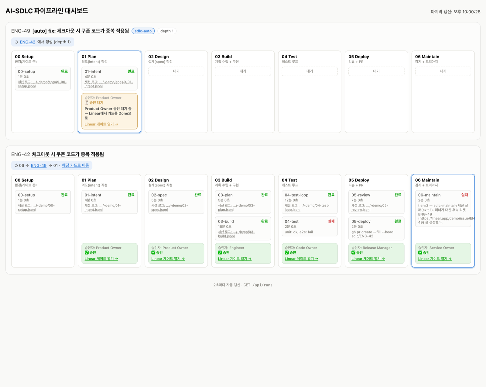

<p align="center">
  
  
  
  = 22" />
</p>

<h1 align="center">🔁 AI-SDLC</h1>
<h3 align="center">내 저장소에 6단계 개발 파이프라인과 승인 게이트를 거는 Claude Code 플러그인</h3>

- [The AI-Native SDLC Playbook](https://claude.com/blog/the-ai-native-sdlc-playbook)을 실제로 돌아가게 만든 플러그인과 러너. 본체는 [`AI_SDLC/`](AI_SDLC/README.md)에 있다.

---

<p align="center">
  
</p>

---

## 무엇이 들어 있나

| 경로 | 내용 |
| --- | --- |
| [`AI_SDLC/`](AI_SDLC/README.md) | Claude Code 플러그인(6단계 스킬, hook, 승인 게이트)과 Linear로 자동 실행하는 러너, 대시보드 |
| [`USAGE.md`](USAGE.md) | 파이프라인 전체 사용 설명서 |
| [`docs/`](docs/) | 원문 정리와 설계 기록 |

---

## 시작하기

플러그인을 설치하고, 내 저장소를 준비하고, 티켓 하나를 넘기면 된다:

```bash
claude plugin marketplace add PeterCha90/FastCampus
claude plugin install ai-native-sdlc@ai-sdlc
```

Claude Code를 다시 시작한 뒤 내 저장소에서:

```
/sdlc-init
/sdlc-run ENG-12
```

설치 범위, 업데이트, Linear로 자동 실행하는 방법은 [`AI_SDLC/README.md`](AI_SDLC/README.md)에 순서대로 있다.

---

<p align="center">
  Made by <a href="https://github.com/PeterCha90">Peter Cha</a>
</p>
